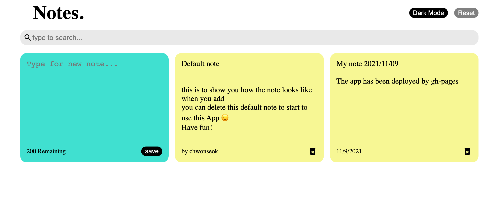
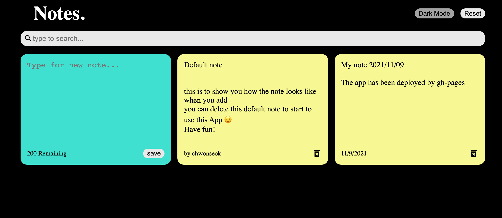

# What's this?

> Normal
> 

> Dark
> 

This is Note App built with React.js, which you can

ADD a note,

SEARCH a note,

DELETE a note,

RESET the note app.

Also, this is RESPONSIVE web app 😉

# Live

https://chwonseok.github.io/react-note-app/

# Dependencies

1. react-icons

   - `npm install react-icons`

2. uniqid

   - `npm install uniqid`

# Hooks used

- `useState()`
- `useEffect()`

# Update History

- 2021.11.09 - Live Version 배포
- 2021.11.08 - reset 버튼 추가
- 2021.11.08 - 필수 기능 갖춘 App 제작 완료
